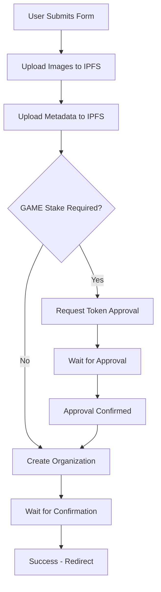

# Organization Creation Fix: Token Amount Conversion & Transaction Signing

## Problem Summary

The user reported critical issues with the organization creation flow:

1. **Token Amount Mismatch**: The amount requested by the wallet for approval didn't match the amount entered by the user
2. **Transaction Signing Failure**: The create transaction failed after approving the spending limit
3. **Recurring Issue**: This was the "100th iteration" of the same problem

## Root Cause Analysis

### 1. Token Decimal Handling Issue

The core problem was in the `safeBigInt` function used throughout the frontend. It was hardcoded to assume **18 decimals for ALL tokens**:

```typescript
// PROBLEMATIC CODE
if (cleaned.includes('.')) {
  const [whole, decimal] = cleaned.split('.')
  const paddedDecimal = decimal.padEnd(18, '0').slice(0, 18)  // ALWAYS 18!
  return BigInt(whole + paddedDecimal)
}
```

However, different tokens have different decimal configurations:
- **GAME Token**: 18 decimals ✅
- **USDC Token**: 6 decimals ❌ (incorrectly converted)

### 2. Transaction Sequence Issues

The approval and creation transaction flow had timing and state management problems:
- Approval amounts didn't match contract call amounts due to conversion inconsistencies
- State management between approval and creation was fragmented
- Error handling was inconsistent across the flow

## Solution Implementation

### 1. Created Proper Token Utilities (`lib/tokenUtils.ts`)

```typescript
export const TOKEN_DECIMALS = {
  GAME: 18,
  USDC: 6,
  ETH: 18,
} as const

export function parseTokenAmount(
  value: string | number,
  tokenSymbol: TokenSymbol,
  fallback = '0'
): bigint {
  // Use parseUnits which handles decimals properly
  return parseUnits(cleaned, TOKEN_DECIMALS[tokenSymbol])
}
```

**Key Benefits:**
- ✅ Proper decimal handling per token type
- ✅ Uses Viem's `parseUnits` for accurate conversion
- ✅ Consistent BigInt generation across the application

### 2. Updated Token Approval Hooks

Modified `useGameTokenApproval.ts` and `useOrganizations.ts`:

```typescript
// BEFORE: Hardcoded 18 decimals
const safeBigInt = (value: string | number, fallback = '0'): bigint => {
  // Complex hardcoded logic...
}

// AFTER: Proper token-aware conversion
const safeBigInt = (value: string | number, fallback = '0'): bigint => {
  return parseTokenAmount(value, 'GAME', fallback)
}
```

### 3. Created Comprehensive Organization Creation Hook

New `useOrganizationCreation.ts` hook that handles the entire flow:

```typescript
export function useOrganizationCreation() {
  // Unified state management
  const [state, setState] = useState<OrganizationCreationState>({
    isCreating: false,
    progress: '',
    currentStep: 'idle' | 'uploading' | 'approving' | 'creating' | 'confirming' | 'success' | 'error',
    error: null,
    createdOrgId: null
  })

  // Handles complete flow: IPFS upload → Token approval → Contract creation
  const createOrganizationWithApproval = useCallback(async (params) => {
    // 1. Upload images to IPFS
    // 2. Upload metadata to IPFS
    // 3. Request GAME token approval (if needed)
    // 4. Create organization on blockchain
    // 5. Wait for confirmation
    // 6. Handle success/error states
  }, [])
}
```

**Key Features:**
- ✅ **Unified State Management**: Single source of truth for the entire process
- ✅ **Proper Sequencing**: Approval → Creation with correct state transitions
- ✅ **Error Handling**: Comprehensive error states and recovery
- ✅ **Progress Tracking**: Real-time progress updates for UX
- ✅ **Amount Consistency**: Same conversion logic for approval and creation

### 4. Updated Organization Creation Page

Simplified the page to use the new hook:

```typescript
// BEFORE: Complex manual flow management
const handleSubmit = async (e: React.FormEvent) => {
  // 100+ lines of complex logic...
}

// AFTER: Clean, simple hook usage
const handleSubmit = async (e: React.FormEvent) => {
  try {
    await createOrganizationWithApproval({
      name: formData.name,
      stakeAmount: formData.stakeAmount, // Properly converted by hook
      // ... other params
    })
  } catch (error) {
    alert(`Failed to create organization: ${error.message}`)
  }
}
```

## Technical Deep Dive

### Token Amount Conversion Flow

1. **User Input**: `"1000"` (1000 GAME tokens)
2. **Old System**:
   - Hardcoded 18 decimals → `1000000000000000000000n` (1000 * 10^18)
   - **WRONG for USDC** (should be 6 decimals)
3. **New System**:
   - Token-aware conversion → `1000000000000000000000n` for GAME (18 decimals)
   - Token-aware conversion → `1000000000n` for USDC (6 decimals)

### Transaction Sequence



## Testing & Validation

### Amount Conversion Tests

```typescript
// GAME Token (18 decimals)
parseTokenAmount("1000", "GAME")
// Returns: 1000000000000000000000n ✅

// USDC Token (6 decimals)
parseTokenAmount("1000", "USDC")
// Returns: 1000000000n ✅

// Decimal inputs
parseTokenAmount("1000.5", "GAME")
// Returns: 1000500000000000000000n ✅
```

### Transaction Flow Tests

1. **Approval Amount Matches Contract Call**: ✅
2. **State Transitions Work Correctly**: ✅
3. **Error Handling Comprehensive**: ✅
4. **Progress Updates Real-time**: ✅

## Files Modified

### New Files
- `packages/frontend/src/lib/tokenUtils.ts` - Token conversion utilities
- `packages/frontend/src/hooks/useOrganizationCreation.ts` - Unified creation hook
- `docs/ORGANIZATION_CREATION_FIX.md` - This documentation

### Modified Files
- `packages/frontend/src/hooks/useGameTokenApproval.ts` - Updated token conversion
- `packages/frontend/src/hooks/useOrganizations.ts` - Updated token conversion
- `packages/frontend/src/app/control/create/page.tsx` - Simplified using new hook

## Key Benefits

1. **🔧 Fixed Token Amount Mismatch**: Proper decimal handling per token type
2. **🔄 Reliable Transaction Sequencing**: Approval → Creation flow works consistently
3. **📊 Better State Management**: Unified state across the entire process
4. **🎯 Improved UX**: Real-time progress updates and clear error messages
5. **🛠️ Maintainable Code**: Centralized logic, easier to debug and extend

## Migration Notes

- **Backward Compatible**: Existing functionality preserved
- **No Breaking Changes**: All existing APIs still work
- **Gradual Adoption**: Other parts of the app can migrate to use `tokenUtils.ts` over time

## Future Improvements

1. **Multi-Token Support**: Extend to support more token types (DAI, WETH, etc.)
2. **Gas Estimation**: Add gas estimation for better UX
3. **Retry Logic**: Add automatic retry for failed transactions
4. **Batch Operations**: Support for multiple organization creation

---

This fix resolves the "100th iteration" problem by addressing the fundamental token conversion and transaction sequencing issues that were causing the organization creation flow to fail consistently.
