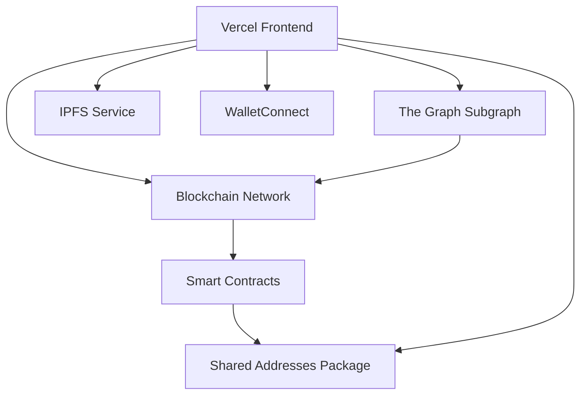

# GameDAO Frontend - Vercel Deployment Plan

**Created:** July 28, 2025
**Status:** Planning Phase
**Objective:** Deploy GameDAO v3 frontend to Vercel with full Web3 functionality

## 🏗️ Architecture Overview

The GameDAO frontend is a Next.js application that depends on several external services and infrastructure components:



## 📋 Prerequisites & Dependencies

### 1. **Smart Contracts** *(Must Deploy First)*
- **Location:** `packages/contracts-solidity/`
- **Networks Supported:** Hardhat Local (31337), Sepolia (11155111), Ethereum Mainnet (1), Polygon (137), Soneium
- **Key Contracts:** Registry, Control, Flow, Signal, Sense, Identity, Membership, Staking
- **Dependencies:** Game Token, USDC Token

### 2. **The Graph Subgraph** *(Must Deploy After Contracts)*
- **Location:** `packages/subgraph/`
- **Purpose:** Indexes blockchain events for efficient data queries
- **Dependencies:** Deployed smart contracts with verified addresses

### 3. **Shared Package** *(Auto-generated)*
- **Location:** `packages/shared/`
- **Contains:** Contract ABIs and addresses
- **Auto-updates:** After contract deployments

### 4. **External Services**
- **IPFS:** For metadata storage (suggestions: Pinata, Web3.Storage, or Infura IPFS)
- **RPC Providers:** Infura, Alchemy, or similar
- **WalletConnect:** Project ID required

## 🚀 Deployment Plan

### Phase 1: Infrastructure Setup

#### Step 1.1: Deploy Smart Contracts

**For Testnet (Sepolia) - Recommended First:**
```bash
# 1. Configure environment
cp env.template .env.local

# 2. Add Sepolia configuration to .env.local
SEPOLIA_URL=https://sepolia.infura.io/v3/YOUR_INFURA_PROJECT_ID
PRIVATE_KEY=your_deployment_private_key
ETHERSCAN_API_KEY=your_etherscan_api_key

# 3. Deploy contracts
make deploy NETWORK=sepolia

# 4. Verify contracts (optional but recommended)
make verify NETWORK=sepolia
```

**For Mainnet (Production):**
```bash
# Use same process but with mainnet configuration
make deploy NETWORK=mainnet
make verify NETWORK=mainnet
```

#### Step 1.2: Deploy Subgraph

**Prerequisites:**
- Contracts must be deployed and verified
- Create account on [The Graph Studio](https://thegraph.com/studio/)

**Deployment Process:**
```bash
# 1. Update subgraph with deployed contract addresses
cd packages/subgraph
npm run update-addresses

# 2. Generate subgraph code
npm run codegen

# 3. Build subgraph
npm run build

# 4. Deploy to The Graph Studio
graph auth --studio YOUR_DEPLOY_KEY
graph deploy --studio gamedao-protocol
```

#### Step 1.3: Configure IPFS Service

**Option A: Pinata (Recommended)**
1. Sign up at [Pinata.cloud](https://pinata.cloud)
2. Get API keys
3. Add to environment variables

**Option B: Web3.Storage**
1. Sign up at [Web3.Storage](https://web3.storage)
2. Get API token
3. Add to environment variables

### Phase 2: Vercel Configuration

#### Step 2.1: Environment Variables Setup

Create the following environment variables in Vercel:

**Network Configuration:**
```bash
NEXT_PUBLIC_DEFAULT_CHAIN_ID=11155111  # Sepolia for staging, 1 for production

# RPC URLs
SEPOLIA_URL=https://sepolia.infura.io/v3/YOUR_INFURA_PROJECT_ID
MAINNET_URL=https://mainnet.infura.io/v3/YOUR_INFURA_PROJECT_ID
POLYGON_URL=https://polygon-rpc.com
```

**Contract Addresses (auto-populated after deployment):**
```bash
# Sepolia Testnet
NEXT_PUBLIC_REGISTRY_ADDRESS_SEPOLIA=0x...
NEXT_PUBLIC_CONTROL_ADDRESS_SEPOLIA=0x...
NEXT_PUBLIC_FLOW_ADDRESS_SEPOLIA=0x...
# ... (all contract addresses)

# Mainnet (for production)
NEXT_PUBLIC_REGISTRY_ADDRESS_MAINNET=0x...
# ... (all contract addresses)
```

**External Services:**
```bash
# WalletConnect (required)
NEXT_PUBLIC_WALLETCONNECT_PROJECT_ID=your_walletconnect_project_id

# IPFS (choose one)
NEXT_PUBLIC_PINATA_JWT=your_pinata_jwt
# OR
NEXT_PUBLIC_WEB3_STORAGE_TOKEN=your_web3_storage_token

# Subgraph URLs
NEXT_PUBLIC_SUBGRAPH_URL_SEPOLIA=https://api.studio.thegraph.com/query/your-subgraph-sepolia/v1
NEXT_PUBLIC_SUBGRAPH_URL_MAINNET=https://api.studio.thegraph.com/query/your-subgraph-mainnet/v1
```

#### Step 2.2: Vercel Project Configuration

**Create `vercel.json` in project root:**
```json
{
  "version": 2,
  "buildCommand": "cd packages/frontend && npm run build",
  "devCommand": "cd packages/frontend && npm run dev",
  "installCommand": "npm install && cd packages/shared && npm run build",
  "outputDirectory": "packages/frontend/.next",
  "framework": "nextjs",
  "regions": ["iad1"],
  "functions": {
    "packages/frontend/src/app/api/**/*.ts": {
      "runtime": "nodejs18.x"
    }
  }
}
```

**Update `packages/frontend/package.json` scripts:**
```json
{
  "scripts": {
    "build": "npm run prebuild && next build",
    "prebuild": "cd ../shared && npm run build"
  }
}
```

### Phase 3: Deployment Execution

#### Step 3.1: Prepare Repository

1. **Ensure shared package builds correctly:**
```bash
cd packages/shared
npm run build
```

2. **Test frontend build locally:**
```bash
cd packages/frontend
npm run build
```

3. **Commit all changes to git**

#### Step 3.2: Deploy to Vercel

**Option A: Vercel CLI (Recommended)**
```bash
# Install Vercel CLI
npm i -g vercel

# Login to Vercel
vercel login

# Deploy
vercel --prod
```

**Option B: GitHub Integration**
1. Connect repository to Vercel
2. Configure environment variables in Vercel dashboard
3. Trigger deployment

#### Step 3.3: Post-Deployment Verification

**Test the following functionality:**
1. ✅ Website loads and displays correctly
2. ✅ Wallet connection works (MetaMask, WalletConnect, etc.)
3. ✅ Contract interactions function properly
4. ✅ Subgraph data loads correctly
5. ✅ IPFS metadata loading works
6. ✅ Cross-platform compatibility (mobile/desktop)

## 🔧 Configuration Files Required

### 1. Update `packages/frontend/next.config.mjs`
```javascript
/** @type {import('next').NextConfig} */
const nextConfig = {
  transpilePackages: ['@gamedao/evm'],
  experimental: {
    esmExternals: 'loose',
  },
  // Add for production
  poweredByHeader: false,
  reactStrictMode: true,
  swcMinify: true,
};

export default nextConfig;
```

### 2. Create `.env.production` in frontend directory
```bash
# Production environment overrides
NEXT_PUBLIC_DEFAULT_CHAIN_ID=1  # Mainnet for production
NODE_ENV=production
```

## 🚨 Critical Considerations

### Security
- ⚠️ **Never commit private keys** - use Vercel environment variables
- ⚠️ **Use environment-specific contract addresses**
- ⚠️ **Enable rate limiting** for RPC endpoints
- ⚠️ **Validate all contract addresses** before deployment

### Performance
- 📊 **Bundle size**: Monitor Next.js bundle analyzer
- 📊 **IPFS loading**: Implement loading states and fallbacks
- 📊 **RPC calls**: Implement proper caching and error handling
- 📊 **Subgraph queries**: Optimize GraphQL queries

### Monitoring
- 📈 **Vercel Analytics**: Enable Web Analytics
- 📈 **Error tracking**: Consider Sentry integration
- 📈 **Performance monitoring**: Monitor Core Web Vitals
- 📈 **Contract interaction tracking**: Monitor transaction success rates

## 🔄 Development Workflow

### Staging Environment (Sepolia)
1. Deploy contracts to Sepolia
2. Deploy subgraph to The Graph
3. Deploy frontend to Vercel preview branch
4. Test all functionality

### Production Deployment
1. Deploy contracts to Mainnet
2. Deploy production subgraph
3. Update environment variables
4. Deploy to Vercel production

## 📝 Maintenance Tasks

### Regular Updates
- **Contract addresses**: After any contract upgrades
- **Subgraph**: After contract changes or new features
- **Environment variables**: Keep RPC URLs and API keys current
- **Dependencies**: Regular npm package updates

### Backup Strategy
- **Contract deployment artifacts**: Store in secure location
- **Environment configurations**: Document all settings
- **Subgraph schemas**: Version control all changes

## 🎯 Next Steps

1. **Immediate**: Set up Sepolia testnet deployment
2. **Short-term**: Complete staging environment testing
3. **Medium-term**: Plan mainnet deployment strategy
4. **Long-term**: Implement monitoring and analytics

---

**🔗 Useful Links:**
- [Vercel Docs](https://vercel.com/docs)
- [The Graph Studio](https://thegraph.com/studio/)
- [WalletConnect Cloud](https://cloud.walletconnect.com/)
- [Pinata IPFS](https://pinata.cloud/)
- [Infura RPC](https://infura.io/)

**✅ Checklist Before Deployment:**
- [ ] Smart contracts deployed and verified
- [ ] Subgraph deployed and syncing
- [ ] All environment variables configured
- [ ] IPFS service configured
- [ ] WalletConnect project created
- [ ] Frontend builds successfully
- [ ] All tests passing
