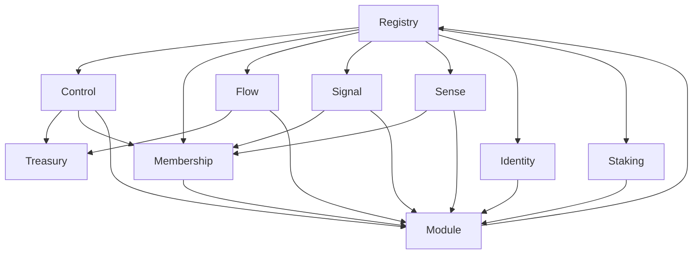

# GameDAO Solidity Contracts Documentation

This directory contains comprehensive documentation for all GameDAO v3 Solidity contracts.

## Architecture Overview

GameDAO v3 implements a modular architecture with the following key components:

### Core Contracts
- **Registry**: Central registry for all GameDAO modules and organizations
- **Module**: Base contract that all GameDAO modules inherit from
- **Treasury**: Manages organization treasuries and financial operations

### Module Contracts
- **Control**: Organization creation and management
- **Membership**: Comprehensive membership management system
- **Flow**: Crowdfunding and campaign management
- **Signal**: Voting and governance system
- **Sense**: Reputation and achievement system
- **Identity**: User identity and profile management
- **Staking**: Token staking and rewards
- **Battlepass**: Gaming achievement system

### Interfaces
All contracts implement well-defined interfaces that ensure consistency and enable upgradability.

## Contract Size Limits

All contracts are optimized to stay under the 24KB deployment limit:

| Contract | Size | Status |
|----------|------|---------|
| Control | 17.056 KiB | ✅ |
| Membership | 17.329 KiB | ✅ |
| Flow | 19.131 KiB | ✅ |
| Signal | 19.218 KiB | ✅ |
| Sense | 8.907 KiB | ✅ |
| Staking | 12.908 KiB | ✅ |
| Registry | 7.761 KiB | ✅ |
| Treasury | ~10 KiB | ✅ |

## Documentation Structure

```
solidity/
├── README.md                    # This overview
├── architecture.md              # Overall architecture design
├── core/                        # Core contract documentation
│   ├── Registry.md
│   ├── Module.md
│   └── Treasury.md
├── modules/                     # Module contract documentation
│   ├── Control.md
│   ├── Membership.md
│   ├── Flow.md
│   ├── Signal.md
│   ├── Sense.md
│   ├── Identity.md
│   ├── Staking.md
│   └── Battlepass.md
├── interfaces/                  # Interface documentation
│   └── interfaces.md
├── libraries/                   # Library documentation
│   └── libraries.md
├── deployment/                  # Deployment guides
│   ├── deployment-guide.md
│   └── configuration.md
└── testing/                     # Testing documentation
    ├── testing-guide.md
    └── test-coverage.md
```

## Key Features

### Modular Design
- Each module is independent and can be upgraded separately
- Common functionality is abstracted into the base Module contract
- Clean separation of concerns

### Security
- All contracts inherit from OpenZeppelin's security contracts
- Role-based access control
- Reentrancy protection
- Pausable functionality

### Gas Optimization
- Batch operations where possible
- Efficient storage patterns
- Minimal external calls

### Upgradability
- Interface-based design enables future upgrades
- Registry pattern allows module replacement
- Versioning support

## Getting Started

1. **Read the Architecture**: Start with [architecture.md](./architecture.md)
2. **Core Contracts**: Understand the foundation in [core/](./core/)
3. **Module Contracts**: Explore specific functionality in [modules/](./modules/)
4. **Deployment**: Follow the [deployment guide](./deployment/deployment-guide.md)
5. **Testing**: Run tests using the [testing guide](./testing/testing-guide.md)

## Development Guidelines

- Always extend OpenZeppelin contracts rather than reimplementing
- Keep contracts under 24KB deployment limit
- Write comprehensive tests for all functionality
- Document all public functions and events
- Follow consistent naming conventions

## Contract Interactions



## Support

For questions or issues with the contracts:
- Check the specific contract documentation
- Review the test files for usage examples
- Consult the deployment guides for setup instructions
