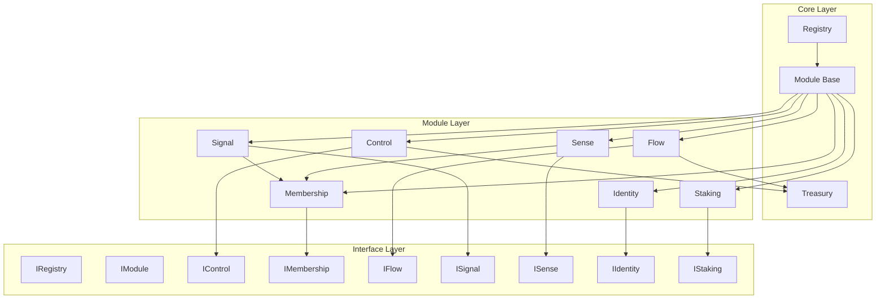
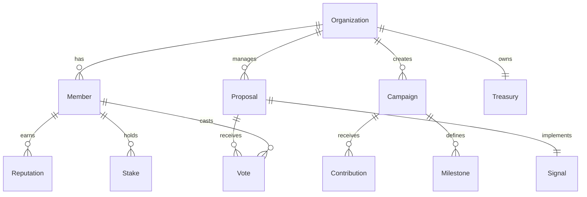

# GameDAO v3 Contract Architecture

## Overview

GameDAO v3 implements a modular, upgradable architecture designed for gaming DAOs and organizations. The system is built around a central registry pattern with independent modules that can be upgraded separately.

## Design Principles

### 1. Modularity
- Each module is independent and focused on specific functionality
- Modules can be upgraded without affecting others
- Clear separation of concerns

### 2. Security First
- All contracts inherit from OpenZeppelin security contracts
- Role-based access control (RBAC)
- Reentrancy protection
- Pausable functionality for emergency stops

### 3. Gas Efficiency
- Batch operations where possible
- Efficient storage patterns
- Minimal external calls
- Optimized for common use cases

### 4. Upgradability
- Interface-based design enables future upgrades
- Registry pattern allows module replacement
- Version management for compatibility

## Core Architecture Components

### Registry Pattern
The `Registry` contract serves as the central hub that:
- Maintains addresses of all modules
- Handles module registration and upgrades
- Provides access control for system-wide operations
- Manages organization lifecycle

### Module Base Contract
All modules inherit from the `Module` base contract which provides:
- Common initialization patterns
- Access control integration
- Pausable functionality
- Reentrancy protection
- Registry integration

### Treasury System
The `Treasury` contract manages:
- Organization funds and tokens
- Payment processing
- Fee collection
- Multi-token support

## Module Architecture

### Control Module
**Purpose**: Organization creation and management
**Key Features**:
- Organization creation with configurable parameters
- Basic organization management
- Integration with membership and treasury systems
- Alphanumeric ID generation

### Membership Module
**Purpose**: Comprehensive membership management
**Key Features**:
- Member states (Inactive, Active, Paused, Kicked, Banned)
- Membership tiers (Basic, Premium, VIP, Founder)
- Voting power calculation and delegation
- Reputation system with rewards/slashing
- Batch operations for efficiency

### Flow Module
**Purpose**: Crowdfunding and campaign management
**Key Features**:
- Campaign creation and management
- Funding collection with multiple tokens
- Milestone-based funding release
- Contributor rewards and incentives
- Campaign governance integration

### Signal Module
**Purpose**: Voting and governance system
**Key Features**:
- Proposal creation and voting
- Multiple voting mechanisms
- Delegation support
- Quorum and threshold management
- Integration with membership for voting power

### Sense Module
**Purpose**: Reputation and achievement system
**Key Features**:
- Reputation scoring and tracking
- Achievement badges and rewards
- Skill verification and endorsements
- Reputation-based access control
- Integration with other modules

### Identity Module
**Purpose**: User identity and profile management
**Key Features**:
- User profile management
- Identity verification
- Social connections
- Privacy controls
- Cross-platform identity linking

### Staking Module
**Purpose**: Token staking and rewards
**Key Features**:
- Multiple staking pools
- Reward distribution mechanisms
- Lock-up periods and penalties
- Delegation support
- Integration with governance

## Data Flow Architecture



## Access Control Architecture

### Role Hierarchy
```
ADMIN_ROLE (Registry)
├── MODULE_ADMIN_ROLE
│   ├── ORGANIZATION_MANAGER_ROLE
│   ├── MEMBERSHIP_ADMIN_ROLE
│   ├── CAMPAIGN_MANAGER_ROLE
│   ├── VOTING_ADMIN_ROLE
│   ├── REPUTATION_MANAGER_ROLE
│   └── STAKING_ADMIN_ROLE
└── TREASURY_ADMIN_ROLE
    ├── TREASURY_MANAGER_ROLE
    └── PAYMENT_PROCESSOR_ROLE
```

### Permission Model
- **Admin Roles**: Full control over respective modules
- **Manager Roles**: Operational permissions for specific functions
- **User Roles**: Basic interaction permissions
- **Organization Roles**: Context-specific permissions within organizations

## Storage Architecture

### Efficient Patterns
- **Packed Structs**: Minimize storage slots
- **Mapping Optimization**: Use appropriate key types
- **Batch Operations**: Reduce gas costs
- **Event Indexing**: Optimize for queries

### Data Relationships


## Upgrade Architecture

### Module Replacement
1. Deploy new module version
2. Update registry with new address
3. Migrate data if necessary
4. Update frontend to use new interface

### Interface Versioning
- Interfaces define contract compatibility
- Version numbers track breaking changes
- Backward compatibility where possible

### Migration Strategy
- Data migration contracts for complex upgrades
- Gradual rollout with feature flags
- Rollback capabilities for critical issues

## Security Architecture

### Multi-Layer Security
1. **Contract Level**: OpenZeppelin security contracts
2. **Module Level**: Role-based access control
3. **Function Level**: Modifier-based protection
4. **Data Level**: Input validation and sanitization

### Emergency Procedures
- **Pause Mechanism**: Stop all operations if needed
- **Access Revocation**: Remove compromised accounts
- **Module Isolation**: Disable specific modules
- **Treasury Protection**: Secure funds during incidents

## Gas Optimization Strategies

### Batch Operations
- Multiple membership operations in single transaction
- Bulk voting and delegation
- Batch reward distribution

### Storage Optimization
- Packed structs for related data
- Efficient mapping structures
- Minimal state changes

### Function Optimization
- Early returns for common cases
- Cached calculations
- Minimal external calls

## Testing Architecture

### Test Categories
1. **Unit Tests**: Individual contract functions
2. **Integration Tests**: Module interactions
3. **System Tests**: End-to-end workflows
4. **Gas Tests**: Performance optimization
5. **Security Tests**: Attack vectors and edge cases

### Test Patterns
- Mock contracts for dependencies
- Test fixtures for common scenarios
- Property-based testing for edge cases
- Formal verification for critical functions

## Deployment Architecture

### Environment Strategy
- **Development**: Local hardhat network
- **Staging**: Testnet deployment
- **Production**: Mainnet deployment

### Deployment Pipeline
1. Contract compilation and size validation
2. Test execution and coverage verification
3. Security audit and review
4. Staged deployment with monitoring
5. Frontend integration and testing

## Monitoring and Maintenance

### Event Monitoring
- All state changes emit events
- Indexed parameters for efficient querying
- Error events for debugging

### Health Checks
- Contract size monitoring
- Gas usage tracking
- Function call frequency analysis
- Error rate monitoring

This architecture provides a solid foundation for GameDAO v3 while maintaining flexibility for future enhancements and optimizations.
