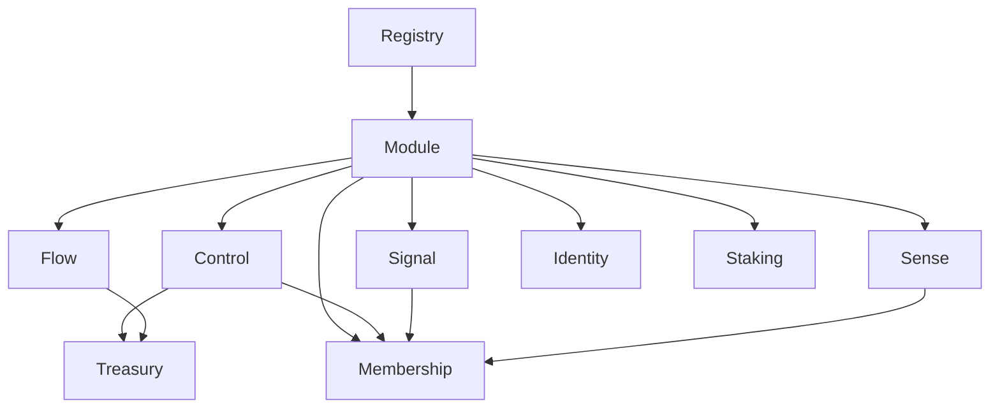

# GameDAO Solidity Deployment Guide

## Overview

This guide provides comprehensive instructions for deploying GameDAO v3 Solidity contracts across different environments. The deployment process is designed to be secure, repeatable, and auditable.

## Prerequisites

### Environment Setup
- Node.js 18+ installed
- npm or yarn package manager
- Git for version control
- Access to target blockchain network

### Required Tools
- Hardhat development environment
- Ethers.js for contract interactions
- OpenZeppelin CLI for upgrades
- Slither for security analysis

### Network Access
- RPC endpoint for target network
- Funded deployer account
- Gas price monitoring tools
- Block explorer access

## Deployment Architecture

### Contract Deployment Order

1. **Core Contracts**
   - Registry (central hub)
   - Module (base contract)
   - Treasury (financial operations)

2. **Module Contracts**
   - Control (organization management)
   - Membership (member management)
   - Flow (crowdfunding)
   - Signal (governance)
   - Sense (reputation)
   - Identity (user profiles)
   - Staking (token staking)

3. **Supporting Contracts**
   - Mock tokens (for testing)
   - Test helpers
   - Upgrade contracts

### Dependencies



## Environment Configuration

### Development Environment

```bash
# Install dependencies
npm install

# Start local hardhat node
npx hardhat node

# Deploy to local network
npx hardhat run scripts/deploy.ts --network localhost
```

### Staging Environment

```bash
# Configure staging network
export STAGING_RPC_URL="https://staging-rpc.example.com"
export STAGING_PRIVATE_KEY="0x..."
export STAGING_ETHERSCAN_API_KEY="..."

# Deploy to staging
npx hardhat run scripts/deploy.ts --network staging
```

### Production Environment

```bash
# Configure production network
export MAINNET_RPC_URL="https://mainnet.infura.io/v3/..."
export MAINNET_PRIVATE_KEY="0x..."
export MAINNET_ETHERSCAN_API_KEY="..."

# Deploy to mainnet
npx hardhat run scripts/deploy.ts --network mainnet
```

## Deployment Scripts

### Main Deployment Script

```typescript
// scripts/deploy.ts
import { ethers } from "hardhat";
import { DeploymentConfig, deployGameDAO } from "./deployment-utils";

async function main() {
    const [deployer] = await ethers.getSigners();
    console.log("Deploying contracts with account:", deployer.address);

    const config: DeploymentConfig = {
        deployer: deployer.address,
        initialTokens: [
            "0x...", // USDC
            "0x...", // USDT
            "0x...", // DAI
        ],
        platformFee: 250, // 2.5%
        emergencyAdmin: deployer.address,
    };

    const deployment = await deployGameDAO(config);

    console.log("Deployment completed:");
    console.log("Registry:", deployment.registry.address);
    console.log("Treasury:", deployment.treasury.address);
    console.log("Control:", deployment.control.address);
    console.log("Membership:", deployment.membership.address);

    // Verify contracts
    await verifyContracts(deployment);

    // Save deployment addresses
    await saveDeploymentAddresses(deployment);
}

main().catch((error) => {
    console.error(error);
    process.exitCode = 1;
});
```

### Deployment Utilities

```typescript
// scripts/deployment-utils.ts
export interface DeploymentConfig {
    deployer: string;
    initialTokens: string[];
    platformFee: number;
    emergencyAdmin: string;
}

export interface DeploymentResult {
    registry: Contract;
    treasury: Contract;
    control: Contract;
    membership: Contract;
    flow: Contract;
    signal: Contract;
    sense: Contract;
    identity: Contract;
    staking: Contract;
}

export async function deployGameDAO(config: DeploymentConfig): Promise<DeploymentResult> {
    // Deploy core contracts
    const registry = await deployRegistry(config);
    const treasury = await deployTreasury(config);

    // Deploy modules
    const control = await deployControl(config);
    const membership = await deployMembership(config);
    const flow = await deployFlow(config);
    const signal = await deploySignal(config);
    const sense = await deploySense(config);
    const identity = await deployIdentity(config);
    const staking = await deployStaking(config);

    // Initialize contracts
    await initializeContracts({
        registry,
        treasury,
        control,
        membership,
        flow,
        signal,
        sense,
        identity,
        staking,
    });

    return {
        registry,
        treasury,
        control,
        membership,
        flow,
        signal,
        sense,
        identity,
        staking,
    };
}
```

## Contract Verification

### Automated Verification

```typescript
// scripts/verify-contracts.ts
export async function verifyContracts(deployment: DeploymentResult) {
    const contracts = [
        { name: "Registry", address: deployment.registry.address },
        { name: "Treasury", address: deployment.treasury.address },
        { name: "Control", address: deployment.control.address },
        { name: "Membership", address: deployment.membership.address },
        { name: "Flow", address: deployment.flow.address },
        { name: "Signal", address: deployment.signal.address },
        { name: "Sense", address: deployment.sense.address },
        { name: "Identity", address: deployment.identity.address },
        { name: "Staking", address: deployment.staking.address },
    ];

    for (const contract of contracts) {
        try {
            await hre.run("verify:verify", {
                address: contract.address,
                constructorArguments: getConstructorArgs(contract.name),
            });
            console.log(`✅ ${contract.name} verified`);
        } catch (error) {
            console.log(`❌ ${contract.name} verification failed:`, error);
        }
    }
}
```

### Manual Verification

```bash
# Verify individual contracts
npx hardhat verify --network mainnet 0x... "constructor" "arguments"

# Verify with constructor arguments file
npx hardhat verify --network mainnet 0x... --constructor-args arguments.js
```

## Security Checks

### Pre-Deployment Security

```bash
# Run security analysis
slither . --exclude-informational --exclude-low

# Check contract sizes
npx hardhat size-contracts

# Run comprehensive tests
npm test

# Check gas usage
npx hardhat test --gas-report
```

### Post-Deployment Security

```typescript
// scripts/security-checks.ts
export async function performSecurityChecks(deployment: DeploymentResult) {
    // Check contract ownership
    await checkOwnership(deployment);

    // Verify access controls
    await verifyAccessControls(deployment);

    // Check initialization state
    await checkInitialization(deployment);

    // Verify module registration
    await verifyModuleRegistration(deployment);

    // Test emergency functions
    await testEmergencyFunctions(deployment);
}
```

## Configuration Management

### Network Configuration

```typescript
// hardhat.config.ts
export default {
    networks: {
        localhost: {
            url: "http://127.0.0.1:8545",
            chainId: 31337,
        },
        goerli: {
            url: process.env.GOERLI_RPC_URL,
            accounts: [process.env.PRIVATE_KEY],
            chainId: 5,
        },
        mainnet: {
            url: process.env.MAINNET_RPC_URL,
            accounts: [process.env.PRIVATE_KEY],
            chainId: 1,
            gasPrice: "auto",
        },
    },
    etherscan: {
        apiKey: {
            mainnet: process.env.ETHERSCAN_API_KEY,
            goerli: process.env.ETHERSCAN_API_KEY,
        },
    },
};
```

### Environment Variables

```bash
# .env.example
PRIVATE_KEY=0x...
MAINNET_RPC_URL=https://mainnet.infura.io/v3/...
GOERLI_RPC_URL=https://goerli.infura.io/v3/...
ETHERSCAN_API_KEY=...
COINMARKETCAP_API_KEY=...
```

## Deployment Monitoring

### Real-time Monitoring

```typescript
// scripts/monitor-deployment.ts
export async function monitorDeployment(deployment: DeploymentResult) {
    // Monitor contract states
    setInterval(async () => {
        const registryHealth = await checkRegistryHealth(deployment.registry);
        const treasuryHealth = await checkTreasuryHealth(deployment.treasury);

        console.log("Health Check:", {
            registry: registryHealth,
            treasury: treasuryHealth,
            timestamp: new Date().toISOString(),
        });
    }, 60000); // Check every minute
}
```

### Deployment Logs

```typescript
// scripts/deployment-logger.ts
export class DeploymentLogger {
    private logFile: string;

    constructor(network: string) {
        this.logFile = `logs/deployment-${network}-${Date.now()}.log`;
    }

    log(message: string, data?: any) {
        const entry = {
            timestamp: new Date().toISOString(),
            message,
            data,
        };

        fs.appendFileSync(this.logFile, JSON.stringify(entry) + '\n');
        console.log(message, data);
    }
}
```

## Upgrade Procedures

### Upgrade Preparation

```typescript
// scripts/prepare-upgrade.ts
export async function prepareUpgrade(contractName: string, newImplementation: string) {
    // Validate new implementation
    await validateImplementation(newImplementation);

    // Check compatibility
    await checkCompatibility(contractName, newImplementation);

    // Prepare upgrade proposal
    const proposal = await prepareUpgradeProposal(contractName, newImplementation);

    return proposal;
}
```

### Upgrade Execution

```typescript
// scripts/execute-upgrade.ts
export async function executeUpgrade(proposalId: string) {
    // Validate proposal
    await validateProposal(proposalId);

    // Execute upgrade
    await executeUpgradeProposal(proposalId);

    // Verify upgrade
    await verifyUpgrade(proposalId);

    // Update deployment records
    await updateDeploymentRecords(proposalId);
}
```

## Rollback Procedures

### Emergency Rollback

```typescript
// scripts/emergency-rollback.ts
export async function emergencyRollback(contractName: string, previousVersion: string) {
    console.log(`🚨 Emergency rollback initiated for ${contractName}`);

    // Pause current contract
    await pauseContract(contractName);

    // Switch to previous version
    await switchToVersion(contractName, previousVersion);

    // Verify rollback
    await verifyRollback(contractName, previousVersion);

    console.log(`✅ Emergency rollback completed for ${contractName}`);
}
```

## Testing Deployment

### Deployment Tests

```typescript
// test/deployment.test.ts
describe("Deployment", () => {
    it("should deploy all contracts successfully", async () => {
        const deployment = await deployGameDAO(testConfig);

        expect(deployment.registry.address).to.be.properAddress;
        expect(deployment.treasury.address).to.be.properAddress;
        expect(deployment.control.address).to.be.properAddress;
        expect(deployment.membership.address).to.be.properAddress;
    });

    it("should initialize contracts correctly", async () => {
        const deployment = await deployGameDAO(testConfig);

        const registryVersion = await deployment.registry.version();
        expect(registryVersion).to.equal("1.0.0");

        const controlRegistry = await deployment.control.registry();
        expect(controlRegistry).to.equal(deployment.registry.address);
    });
});
```

### Integration Tests

```typescript
// test/integration.test.ts
describe("Integration", () => {
    it("should create organization end-to-end", async () => {
        const deployment = await deployGameDAO(testConfig);

        // Create organization
        const tx = await deployment.control.createOrganization(
            "Test DAO",
            "Test description",
            ethers.utils.formatBytes32String("DAO"),
            [deployer.address],
            testOrgConfig
        );

        const receipt = await tx.wait();
        const orgId = receipt.events[0].args.orgId;

        // Verify organization exists
        const orgInfo = await deployment.control.getOrganization(orgId);
        expect(orgInfo.name).to.equal("Test DAO");

        // Verify treasury was created
        const treasuryInfo = await deployment.treasury.getTreasury(orgId);
        expect(treasuryInfo.active).to.be.true;

        // Verify membership was set up
        const memberInfo = await deployment.membership.getMemberInfo(orgId, deployer.address);
        expect(memberInfo.state).to.equal(MemberState.Active);
    });
});
```

## Best Practices

### Pre-Deployment
- Run comprehensive security analysis
- Verify contract sizes are under limits
- Test all functionality thoroughly
- Prepare rollback procedures
- Set up monitoring infrastructure

### During Deployment
- Monitor gas prices and network conditions
- Deploy contracts in correct order
- Verify each contract after deployment
- Test integrations immediately
- Document all deployment parameters

### Post-Deployment
- Verify all contracts on block explorer
- Test end-to-end functionality
- Set up continuous monitoring
- Create operational runbooks
- Plan upgrade procedures

### Security Considerations
- Use multi-signature wallets for admin functions
- Implement time delays for critical operations
- Set up emergency pause mechanisms
- Monitor for unusual activity
- Regular security audits

## Troubleshooting

### Common Issues

**Contract Size Exceeded**
```bash
# Check contract sizes
npx hardhat size-contracts

# Optimize contracts
# - Remove unused functions
# - Use libraries for common code
# - Optimize storage layouts
```

**Gas Estimation Failed**
```bash
# Check gas limits
npx hardhat test --gas-report

# Optimize gas usage
# - Use efficient data structures
# - Minimize storage operations
# - Batch operations where possible
```

**Verification Failed**
```bash
# Flatten contracts
npx hardhat flatten contracts/Control.sol > flattened/Control.sol

# Manual verification with flattened source
```

### Recovery Procedures

**Failed Deployment**
1. Identify failed contract
2. Check error logs
3. Fix underlying issue
4. Redeploy from last successful point
5. Update deployment records

**Initialization Failure**
1. Check contract state
2. Verify constructor arguments
3. Re-run initialization if possible
4. Deploy new instance if necessary

This comprehensive deployment guide ensures secure, reliable, and auditable deployment of GameDAO v3 Solidity contracts across all environments.
