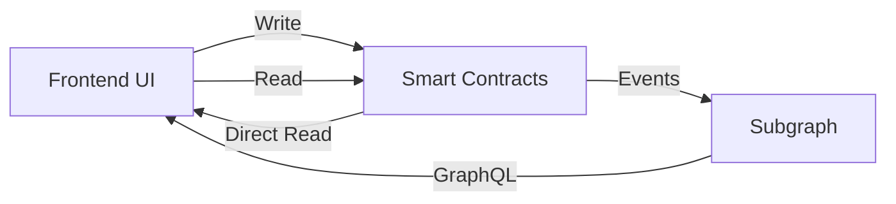

# Frontend Network & Subgraph Integration Plan

**Date**: 2024-06-21
**Phase**: Frontend Demo Integration
**Status**: 📋 PLANNING

## 🎯 **Objective**
Connect the frontend demo application with the deployed smart contracts and subgraph to enable real-time data interaction and live functionality.

## 🔍 **Current State Analysis**

### ✅ **What's Working**
1. **Theme System** - Complete shadcn/ui implementation with light default
2. **Wallet Connection** - Multi-wallet support (MetaMask, Talisman, WalletConnect)
3. **Contract Addresses** - Hardcoded addresses for local network (31337)
4. **Subgraph Schema** - Complete GraphQL schema with all entities
5. **UI Components** - Dashboard cards, forms, and navigation structure
6. **Web3 Configuration** - Wagmi setup with multiple chains

### ❌ **What's Missing**
1. **Live Contract Deployment** - No active local contracts running
2. **Subgraph Deployment** - Graph node not running with deployed subgraph
3. **Apollo Client Setup** - No GraphQL client configuration
4. **Real Contract Interactions** - All hooks use mock data
5. **ABI Integration** - Contract ABIs not imported from deployed contracts
6. **Event Listening** - No real-time contract event subscriptions
7. **Error Handling** - No network error handling for failed transactions

## 📋 **Requirements Collection**

### 1. **Network Infrastructure** 🌐
- [ ] **Local Hardhat Node** - Running with deployed contracts
- [ ] **Graph Node** - IPFS + PostgreSQL + Graph Node running
- [ ] **Subgraph Deployment** - Deployed and syncing with contracts
- [ ] **Contract ABIs** - Exported and available for frontend consumption

### 2. **Frontend Integration** 🖥️
- [ ] **Apollo Client** - GraphQL client setup with subgraph endpoint
- [ ] **Contract Hooks** - Real wagmi hooks for contract interactions
- [ ] **ABI Management** - Dynamic ABI loading from deployment artifacts
- [ ] **Error Boundaries** - Network and transaction error handling
- [ ] **Loading States** - Proper loading indicators for async operations
- [ ] **Real-time Updates** - WebSocket subscriptions for live data

### 3. **Data Flow** 📊
- [ ] **Organizations** - CRUD operations with real Control contract
- [ ] **Campaigns** - Flow contract integration for crowdfunding
- [ ] **Proposals** - Signal contract for governance functionality
- [ ] **User Profiles** - Sense contract for identity management
- [ ] **Treasury Operations** - Real treasury contract interactions

### 4. **User Experience** 👤
- [ ] **Transaction Feedback** - Toast notifications for tx status
- [ ] **Network Switching** - Prompt users to switch to correct network
- [ ] **Gas Estimation** - Show estimated gas costs before transactions
- [ ] **Transaction History** - Show user's transaction history
- [ ] **Pending States** - Show pending transactions in UI

## 🛠️ **Implementation Plan**

### **Phase 1: Infrastructure Setup** (Priority: P0)

#### 1.1 Deploy Local Contract Environment
```bash
# Start local Hardhat node
cd packages/contracts-solidity
npm run node

# Deploy all contracts in separate terminal
npm run deploy:localhost

# Verify deployment addresses
npm run verify:localhost
```

#### 1.2 Start Graph Node Infrastructure
```bash
# Start Graph node with IPFS and PostgreSQL
make graph-node

# Deploy subgraph to local Graph node
make graph-deploy

# Verify GraphQL endpoint
curl http://localhost:8000/subgraphs/name/gamedao/protocol
```

#### 1.3 Update Contract Addresses
```typescript
// packages/frontend/src/lib/contracts.ts
// Update with actual deployed addresses from deployment artifacts
const CONTRACT_ADDRESSES: Record<number, ContractAddresses> = {
  31337: {
    REGISTRY: '0x...', // From deployment output
    CONTROL: '0x...',  // From deployment output
    FLOW: '0x...',     // From deployment output
    SIGNAL: '0x...',   // From deployment output
    SENSE: '0x...',    // From deployment output
  }
}
```

### **Phase 2: GraphQL Integration** (Priority: P0)

#### 2.1 Apollo Client Setup
```typescript
// packages/frontend/src/lib/apollo.ts
import { ApolloClient, InMemoryCache, createHttpLink } from '@apollo/client'
import { useGameDAO } from '@/hooks/useGameDAO'

export function createApolloClient(subgraphUrl: string) {
  return new ApolloClient({
    link: createHttpLink({ uri: subgraphUrl }),
    cache: new InMemoryCache(),
    defaultOptions: {
      watchQuery: {
        errorPolicy: 'all',
        fetchPolicy: 'cache-and-network',
      },
      query: {
        errorPolicy: 'all',
        fetchPolicy: 'cache-and-network',
      },
    },
  })
}
```

#### 2.2 GraphQL Provider Setup
```typescript
// packages/frontend/src/providers/apollo-provider.tsx
'use client'

import { ApolloProvider } from '@apollo/client'
import { createApolloClient } from '@/lib/apollo'
import { useGameDAO } from '@/hooks/useGameDAO'

export function GameDAOApolloProvider({ children }: { children: React.ReactNode }) {
  const { subgraphUrl } = useGameDAO()
  const client = createApolloClient(subgraphUrl)

  return <ApolloProvider client={client}>{children}</ApolloProvider>
}
```

#### 2.3 GraphQL Code Generation
```bash
# Install GraphQL code generation
npm install -D @graphql-codegen/cli @graphql-codegen/typescript @graphql-codegen/typescript-operations @graphql-codegen/typescript-react-apollo

# Generate TypeScript types from subgraph schema
npm run codegen
```

### **Phase 3: Contract Integration** (Priority: P0)

#### 3.1 ABI Management System
```typescript
// packages/frontend/src/lib/abis.ts
import { Abi } from 'viem'

// Import ABIs from deployment artifacts
import RegistryABI from '../../contracts-solidity/artifacts/contracts/GameDAORegistry.sol/GameDAORegistry.json'
import ControlABI from '../../contracts-solidity/artifacts/contracts/Control.sol/Control.json'
// ... other ABIs

export const ABIS = {
  REGISTRY: RegistryABI.abi as Abi,
  CONTROL: ControlABI.abi as Abi,
  FLOW: FlowABI.abi as Abi,
  SIGNAL: SignalABI.abi as Abi,
  SENSE: SenseABI.abi as Abi,
} as const
```

#### 3.2 Enhanced Contract Hooks
```typescript
// packages/frontend/src/hooks/useOrganizations.ts
import { useReadContract, useWriteContract } from 'wagmi'
import { useQuery } from '@apollo/client'
import { GET_ORGANIZATIONS } from '@/graphql/queries'
import { useGameDAO } from './useGameDAO'
import { ABIS } from '@/lib/abis'

export function useOrganizations() {
  const { contracts, isConnected } = useGameDAO()

  // GraphQL query for organizations
  const { data: graphData, loading, error } = useQuery(GET_ORGANIZATIONS)

  // Contract read for organization count
  const { data: orgCount } = useReadContract({
    address: contracts.CONTROL,
    abi: ABIS.CONTROL,
    functionName: 'getOrganizationCount',
    query: { enabled: isConnected },
  })

  // Contract write for creating organization
  const { writeContract: createOrg, isPending } = useWriteContract()

  return {
    organizations: graphData?.organizations || [],
    orgCount: orgCount ? Number(orgCount) : 0,
    loading,
    error,
    createOrganization: (params: CreateOrgParams) => {
      return createOrg({
        address: contracts.CONTROL,
        abi: ABIS.CONTROL,
        functionName: 'createOrganization',
        args: [params.name, params.accessModel, params.memberLimit],
      })
    },
    isCreating: isPending,
  }
}
```

### **Phase 4: Real-time Updates** (Priority: P1)

#### 4.1 WebSocket Subscriptions
```typescript
// packages/frontend/src/lib/subscriptions.ts
import { useSubscription } from '@apollo/client'
import { ORGANIZATION_UPDATED } from '@/graphql/subscriptions'

export function useOrganizationUpdates(orgId: string) {
  const { data, loading } = useSubscription(ORGANIZATION_UPDATED, {
    variables: { id: orgId },
  })

  return {
    updates: data?.organizationUpdated,
    loading,
  }
}
```

#### 4.2 Contract Event Listening
```typescript
// packages/frontend/src/hooks/useContractEvents.ts
import { useWatchContractEvent } from 'wagmi'
import { useGameDAO } from './useGameDAO'
import { ABIS } from '@/lib/abis'

export function useOrganizationEvents() {
  const { contracts } = useGameDAO()

  useWatchContractEvent({
    address: contracts.CONTROL,
    abi: ABIS.CONTROL,
    eventName: 'OrganizationCreated',
    onLogs(logs) {
      console.log('New organization created:', logs)
      // Trigger UI updates, notifications, etc.
    },
  })
}
```

### **Phase 5: User Experience Enhancements** (Priority: P1)

#### 5.1 Transaction Management
```typescript
// packages/frontend/src/hooks/useTransactions.ts
import { useWaitForTransactionReceipt } from 'wagmi'
import { toast } from 'sonner'

export function useTransactionStatus(hash?: `0x${string}`) {
  const { data: receipt, isLoading, isSuccess, isError } = useWaitForTransactionReceipt({
    hash,
  })

  useEffect(() => {
    if (isSuccess) {
      toast.success('Transaction confirmed!')
    }
    if (isError) {
      toast.error('Transaction failed!')
    }
  }, [isSuccess, isError])

  return {
    receipt,
    isLoading,
    isSuccess,
    isError,
  }
}
```

#### 5.2 Network Validation
```typescript
// packages/frontend/src/components/network-guard.tsx
import { useAccount, useSwitchChain } from 'wagmi'
import { useGameDAO } from '@/hooks/useGameDAO'
import { Button } from '@/components/ui/button'

export function NetworkGuard({ children }: { children: React.ReactNode }) {
  const { isConnected } = useAccount()
  const { isSupported, networkName } = useGameDAO()
  const { switchChain } = useSwitchChain()

  if (!isConnected) {
    return <div>Please connect your wallet</div>
  }

  if (!isSupported) {
    return (
      <div className="text-center p-6">
        <h3>Unsupported Network</h3>
        <p>Please switch to {networkName}</p>
        <Button onClick={() => switchChain({ chainId: 31337 })}>
          Switch Network
        </Button>
      </div>
    )
  }

  return <>{children}</>
}
```

## 📊 **Data Flow Architecture**

### **Frontend → Contracts → Subgraph → Frontend**


### **Component Data Sources**
1. **Dashboard** - GraphQL queries for aggregate data
2. **Organization Forms** - Direct contract writes + GraphQL reads
3. **Campaign Lists** - GraphQL queries with real-time subscriptions
4. **Proposal Voting** - Contract writes + event listening
5. **User Profiles** - GraphQL queries + contract reads

## 🎯 **Success Metrics**

### **Technical Metrics**
- [ ] **Contract Deployment** - All 5 modules deployed and verified
- [ ] **Subgraph Sync** - 100% block sync with no errors
- [ ] **Query Performance** - <500ms average GraphQL response time
- [ ] **Transaction Success** - >95% transaction success rate
- [ ] **Real-time Updates** - <2s latency for event propagation

### **User Experience Metrics**
- [ ] **Loading States** - No blank screens during data loading
- [ ] **Error Handling** - Graceful error messages for all failure modes
- [ ] **Transaction Feedback** - Clear status for all user actions
- [ ] **Network Switching** - Automatic network detection and switching prompts
- [ ] **Responsive Design** - Full functionality on mobile devices

## 🚀 **Deployment Checklist**

### **Development Environment**
- [ ] Hardhat node running on port 8545
- [ ] All contracts deployed with verified addresses
- [ ] Graph node running (IPFS: 5001, GraphQL: 8000, Admin: 8020)
- [ ] Subgraph deployed and syncing
- [ ] Frontend running on port 3000 with live data

### **Contract Integration**
- [ ] All ABIs imported and accessible
- [ ] Contract addresses updated in frontend config
- [ ] Wagmi hooks configured for all contract functions
- [ ] Transaction error handling implemented
- [ ] Gas estimation working correctly

### **GraphQL Integration**
- [ ] Apollo Client connected to subgraph endpoint
- [ ] All queries and mutations typed with codegen
- [ ] Real-time subscriptions working
- [ ] Cache management configured
- [ ] Error boundaries implemented

### **User Interface**
- [ ] All mock data replaced with real contract/GraphQL data
- [ ] Loading states implemented for all async operations
- [ ] Transaction pending states shown in UI
- [ ] Success/error notifications working
- [ ] Network switching prompts functional

## 📋 **Next Steps - Implementation Order**

### **Immediate (This Session)**
1. **Deploy Local Infrastructure** - Start Hardhat node and deploy contracts
2. **Update Contract Addresses** - Get real deployment addresses
3. **Start Graph Node** - Deploy subgraph with current contracts

### **Short Term (Next Session)**
1. **Apollo Client Setup** - Connect frontend to subgraph
2. **Replace Mock Data** - Connect first component (Organizations) to real data
3. **Transaction Integration** - Enable real contract writes

### **Medium Term (Following Sessions)**
1. **Complete Integration** - All components using real data
2. **Real-time Features** - WebSocket subscriptions and event listening
3. **Error Handling** - Comprehensive error boundaries and user feedback
4. **Performance Optimization** - Caching, lazy loading, and optimization

---

**Goal**: Transform the current demo frontend into a fully functional application connected to live smart contracts and real-time subgraph data, providing users with a complete GameDAO experience.
