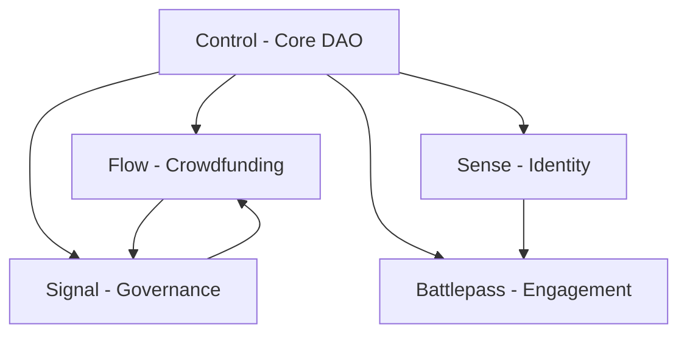

# GameDAO Protocol Technical Analysis

**Date:** 2024-01-XX
**Phase:** Technical Deep Dive
**Status:** Complete

## Module-by-Module Analysis

### 1. Control Module (Core DAO Infrastructure)

**Current Implementation:**
- **Data Structures:**
  - `Org`: Core organization with creator, prime, treasury, access models
  - `OrgType`: Individual, Company, DAO, Hybrid
  - `AccessModel`: Open, Voting, Prime-controlled
  - `FeeModel`: NoFees, Reserve, Transfer
  - `MemberState`: Inactive, Active, Pending, Kicked, Banned, Exited

**Key Functions:**
- `create_org()`: Creates organization with treasury and deposit
- `add_member()`: Adds members with fee payment
- `update_member_state()`: Manages member lifecycle
- `spend_funds()`: Treasury fund management

**Solidity Port Strategy:**
- Use OpenZeppelin's `AccessControl` for permission management
- Implement `Multicall` for batch operations
- Use `ReentrancyGuard` for treasury operations
- Create `IERC20` interface for multi-token support

### 2. Flow Module (Crowdfunding/Treasury)

**Current Implementation:**
- **Data Structures:**
  - `Campaign`: Fundraising campaigns with caps, timelines, governance
  - `FlowProtocol`: Grant, Raise, Lend, Loan, Share, Pool
  - `CampaignState`: Created, Active, Paused, Succeeded, Failed, Locked
  - `FlowGovernance`: Enable/disable withdrawal voting

**Key Functions:**
- `create_campaign()`: Creates fundraising campaigns
- `contribute()`: Handles contributions with automatic processing
- Background finalization with contributor processing

**Solidity Port Strategy:**
- Use OpenZeppelin's `Escrow` pattern for contribution management
- Implement `Pausable` for campaign state management
- Use `SafeERC20` for token interactions
- Create efficient batch processing for large contributor lists

### 3. Signal Module (Governance/Voting)

**Current Implementation:**
- **Data Structures:**
  - `Proposal`: General, Membership, Withdrawal proposals
  - `ProposalState`: Created, Activated, Accepted, Rejected, Expired, Aborted
  - `Majority`: Relative, Absolute, Simple majority voting
  - `VotingPower`: Democratic, token-weighted, quadratic, conviction

**Key Functions:**
- `proposal()`: Creates various proposal types
- `vote()`: Handles voting with deposit mechanics
- Automatic proposal finalization
- Slashing mechanism for rejected proposals

**Solidity Port Strategy:**
- Use OpenZeppelin's `Governor` framework as base
- Implement `GovernorVotes` for voting power
- Create custom `GovernorSettings` for different majority types
- Use `GovernorTimelockControl` for execution delays

### 4. Sense Module (Identity/Reputation)

**Current Implementation:**
- **Data Structures:**
  - `SenseEntity`: User identity extensions
  - Reputation (REP), Experience (XP), Trust (T) tracking
  - Social feedback integration

**Key Functions:**
- `create_entity()`: Creates identity extensions
- `update_property()`: Updates reputation metrics
- Social verification integration

**Solidity Port Strategy:**
- Use ERC-721 for unique identity tokens
- Implement `ERC721Enumerable` for reputation tracking
- Create oracle integration for social verification
- Use merkle proofs for batch reputation updates

### 5. Battlepass Module (Engagement/Rewards)

**Current Implementation:**
- **Data Structures:**
  - Seasonal progression systems
  - Quest/achievement tracking
  - Multi-platform integration
  - NFT reward distribution

**Key Functions:**
- Subscription management
- Quest completion tracking
- Reward claiming with NFT minting
- Season-based progression

**Solidity Port Strategy:**
- Use ERC-1155 for multi-token rewards
- Implement `ERC1155Supply` for tracking
- Create `MerkleProof` for quest verification
- Use `Ownable` for admin functions

## Cross-Module Dependencies



## Proposed Solidity Architecture

### Core Registry Pattern
```solidity
contract GameDAORegistry {
    mapping(bytes32 => address) public modules;
    mapping(bytes32 => bool) public moduleEnabled;

    function setModule(bytes32 moduleId, address moduleAddress) external;
    function getModule(bytes32 moduleId) external view returns (address);
    function enableModule(bytes32 moduleId) external;
    function disableModule(bytes32 moduleId) external;
}
```

### Module Interface Pattern
```solidity
interface IGameDAOModule {
    function moduleId() external pure returns (bytes32);
    function version() external pure returns (string memory);
    function initialize(address registry) external;
    function onModuleEnabled() external;
    function onModuleDisabled() external;
}
```

### Event System
```solidity
contract GameDAOEvents {
    event OrganizationCreated(bytes32 indexed orgId, address indexed creator);
    event CampaignCreated(bytes32 indexed campaignId, bytes32 indexed orgId);
    event ProposalCreated(bytes32 indexed proposalId, bytes32 indexed orgId);
    event MemberAdded(bytes32 indexed orgId, address indexed member);
    event ContributionMade(bytes32 indexed campaignId, address indexed contributor, uint256 amount);
    event VoteCast(bytes32 indexed proposalId, address indexed voter, bool support);
}
```

## Gas Optimization Strategies

1. **Packed Structs**: Optimize storage layout
2. **Bit Flags**: Use single uint256 for multiple boolean states
3. **Batch Operations**: Combine multiple operations
4. **Lazy Loading**: Load data only when needed
5. **Event Indexing**: Use events for off-chain data

## Testing Strategy

### Unit Tests
- Individual module testing
- Permission system testing
- State transition testing
- Edge case handling

### Integration Tests
- Cross-module interactions
- End-to-end workflows
- Governance scenarios
- Treasury management

### Gas Testing
- Function gas costs
- Batch operation efficiency
- Storage optimization validation

## Security Considerations

1. **Access Control**: Multi-level permission system
2. **Reentrancy**: Protect treasury operations
3. **Integer Overflow**: Use SafeMath/built-in checks
4. **Front-running**: MEV protection for voting
5. **Upgrade Safety**: Proxy pattern considerations

## Migration Strategy

1. **Phase 1**: Core infrastructure (Control + Registry)
2. **Phase 2**: Fundraising (Flow module)
3. **Phase 3**: Governance (Signal module)
4. **Phase 4**: Identity (Sense module)
5. **Phase 5**: Engagement (Battlepass module)

## Technology Stack Decisions

### Smart Contracts
- **Solidity**: 0.8.20+
- **OpenZeppelin**: 4.9.0+
- **Hardhat**: Development environment
- **Foundry**: Advanced testing

### Frontend
- **Next.js**: 14+
- **shadcn/ui**: Component library
- **TanStack Query**: Data fetching
- **Viem**: Ethereum interactions
- **Wagmi**: React hooks for Ethereum

### Infrastructure
- **The Graph**: Indexing and querying
- **IPFS**: Decentralized storage
- **Alchemy/Infura**: RPC providers
- **Vercel**: Frontend deployment

## Next Steps

1. Set up monorepo structure
2. Create base contracts and interfaces
3. Implement Control module
4. Build testing framework
5. Start frontend development

## Open Questions

1. **Upgrade Strategy**: Transparent proxies vs. Diamond pattern?
2. **Token Economics**: Native token vs. multi-token support?
3. **Scalability**: L2 deployment strategy?
4. **Governance**: On-chain vs. hybrid governance?
5. **Monetization**: Fee structure and revenue sharing?
